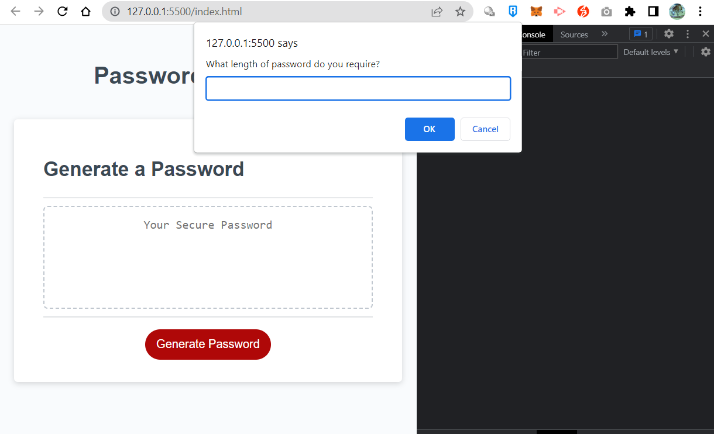
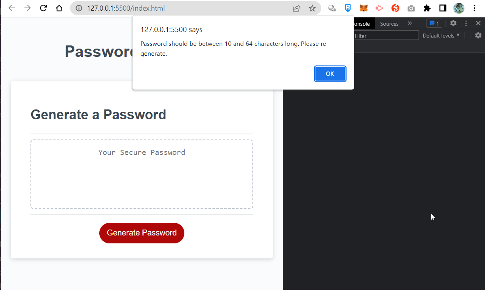
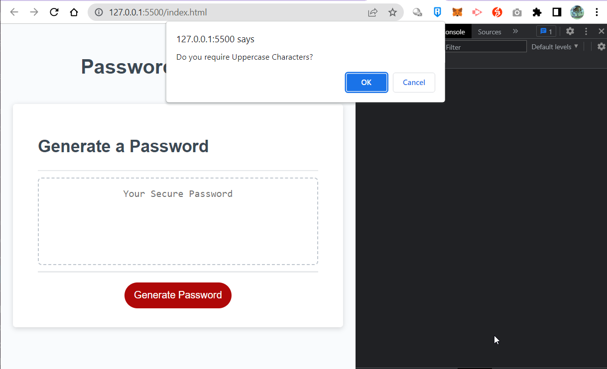
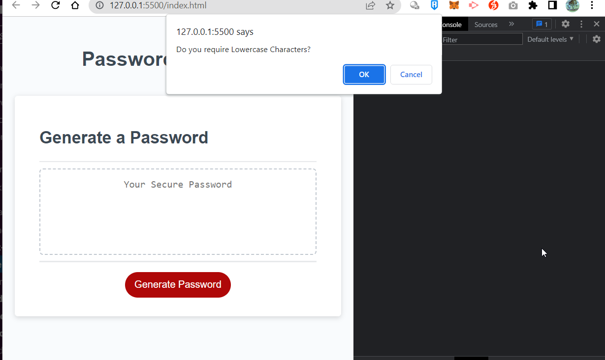
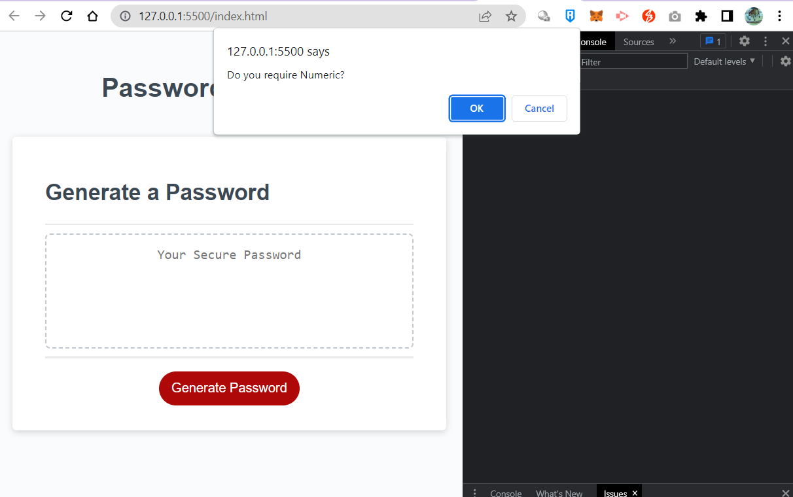
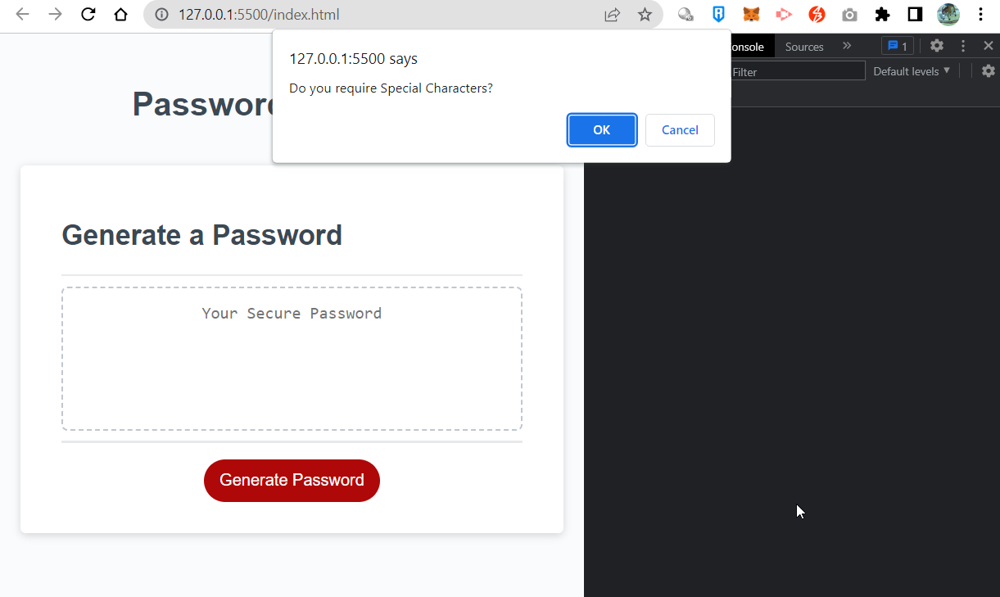
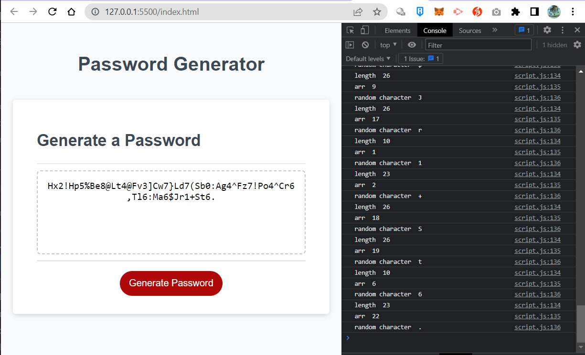
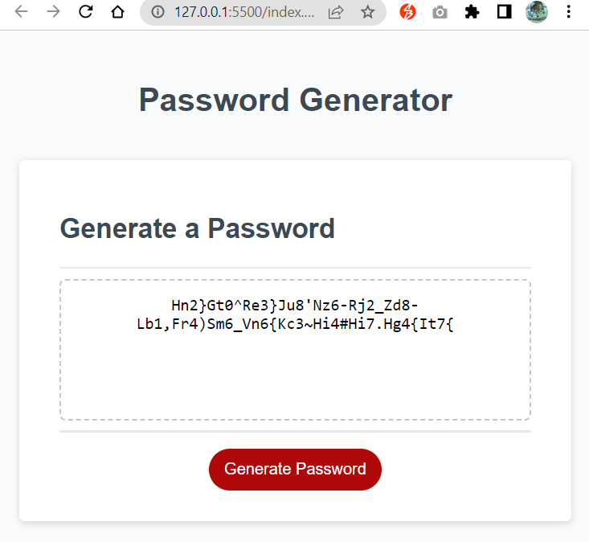

# Password Generator

## Table of Content

1. Description
2. Visual
3. Built with:
4. What I learned
5. Links
6. Resources
7. License

## 1. Description

This is a responsive app for generating password.

## 2. Visual

### Image of the project in console view.

- Image of the project for user to input the preffered password length.

  

- Image of the project when the user input did not meet the password lenght criteria.

  

- Images of prompt for password generating criteria.

  

  

  

  

  - Image when all of the required criteria for generating password has been met.

  

  ### Image of the project in Webpage.

  

## 3. Built with:

- javascript
- html
- css

## 4. What I learned

To see how you can add code functions, see below:

// Function to prompt user for password options
  function getPasswordOptions() {
  let passLengthResponse = prompt("What length of password do you require?");
  passLength = Number(passLengthResponse);
  if (passLength > 9 && passLength < 65) {
  specialCharRequired = confirm("Do you require Special Characters?");
  upperCaseRequired = confirm("Do you require Uppercase Characters?");
  lowerCaseRequired = confirm("Do you require Lowercase Characters?");
  numericRequired = confirm("Do you require Numeric?");
  if (
  specialCharRequired ||
  upperCaseRequired ||
  lowerCaseRequired ||
  numericRequired
  ) {
  // all valid and ok to generate password
  optionsValid = true;
  } else {
  alert("At least one character type must be selected.");
  }
  } else {
  alert(
  "Password should be between 10 and 64 characters long. Please re-generate."
  );
  }
  }

// Function to generate password with user input
  function generatePassword() {
  let constructPassword = "";
  let charCount = 0;

  getPasswordOptions();
  if (optionsValid) {
  for (let i = 0; i < passLength; i++) {
  if (upperCaseRequired === true) {
  constructPassword = constructPassword + getRandom(upperCasedCharacters);
  charCount = charCount + 1;
  if (charCount === passLength) {
  break;
  }
  }
  if (lowerCaseRequired === true) {
  constructPassword = constructPassword + getRandom(lowerCasedCharacters);
  charCount = charCount + 1;
  if (charCount === passLength) {
  break;
  }
  }
  if (numericRequired === true) {
  constructPassword = constructPassword + getRandom(numericCharacters);
  charCount = charCount + 1;
  if (charCount === passLength) {
  break;
  }
  }
  if (specialCharRequired === true) {
  constructPassword = constructPassword + getRandom(specialCharacters);
  charCount = charCount + 1;
  if (charCount === passLength) {
  break;
  }
  }
  }
  return constructPassword;
  }
  }

## 5. Links

### Source code location

https://github.com/chari00/Password-Generator

### Deployed website URL

https://chari00.github.io/Password-Generator/

## 6. Resources

### URL for resources

- https://www.w3schools.com/jsref/jsref_random.asp

- https://javascript.info/alert-prompt-confirm

- https://developer.mozilla.org/en-US/docs/Web/API/Window/prompt

- https://stackoverflow.com/questions/21727317/how-to-check-confirm-password-field-in-form-without-reloading-page

## 7. License

This project is licensed by MIT.
